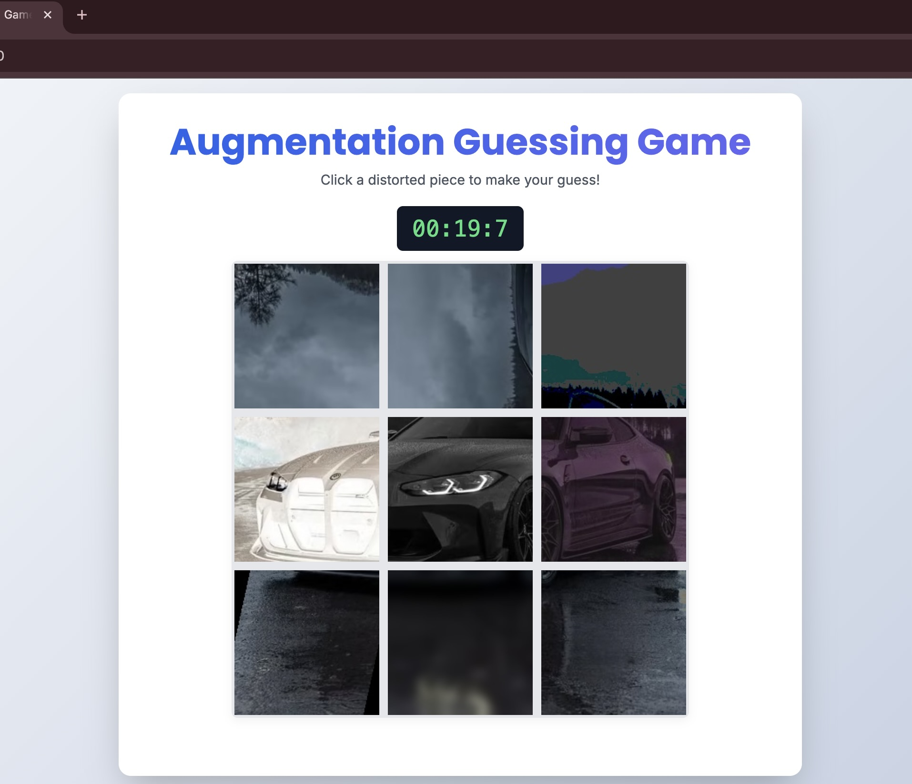

<div align="center">

# 🧩 AugGuess

### *Can you reverse-engineer what PyTorch did to your image?*


</div>

---

## 📸 Screenshot



> *A BMW photo sliced into 9 tiles, each hit with a different torchvision transform. The timer is ticking. Can you guess them all?*

---

## 🤔 What is this?

You upload a photo. The backend **secretly slices it into a 3×3 grid**, applies a different `torchvision` augmentation to each piece, and challenges you to identify which transform was applied to each tile — with **limited attempts**.

It's part game, part PyTorch visual intuition trainer. A Wordle for computer vision nerds.

```
 Your photo                 What you see
┌───┬───┬───┐             ┌───────┬───────┬───────┐
│   │   │   │             │Flipped│Blurred│Inverted│
│ 1 │ 2 │ 3 │   ──────►  │  🤔?  │  🤔?  │   🤔?  │
├───┼───┼───┤             ├───────┼───────┼───────┤
│   │   │   │             │Sheared│Jittery│Grayscl│
│ 4 │ 5 │ 6 │             │  🤔?  │  🤔?  │   🤔?  │
├───┼───┼───┤             ├───────┼───────┼───────┤
│   │   │   │             │Rotated│Solariz│Posterz│
│ 7 │ 8 │ 9 │             │  🤔?  │  🤔?  │   🤔?  │
└───┴───┴───┘             └───────┴───────┴───────┘
```

---

## 🎮 How to Play

**1.** Upload any photo → the backend crops it square, splits it 3×3, and secretly applies 9 unique augmentations.

**2.** You see the distorted tiles. Pick one, guess its augmentation from the full list.

**3.** Wrong? You get a preview of what *your wrong guess* would look like (instant feedback, mad educational).

**4.** Out of attempts? The correct answer is revealed along with the original tile.

**5.** Clear all 9 tiles to win. 

---

## 🧪 Augmentations You'll Face

| Transform | torchvision call |
|---|---|
| Rotate 90° | `T.RandomRotation(degrees=(90, 90))` |
| Horizontal Flip | `T.RandomHorizontalFlip(p=1.0)` |
| Vertical Flip | `T.RandomVerticalFlip(p=1.0)` |
| Grayscale | `T.RandomGrayscale(p=1.0)` |
| Gaussian Blur | `T.GaussianBlur(kernel_size=(23, 23), sigma=(5.0, 5.0))` |
| Solarize | `T.RandomSolarize(threshold=128.0, p=1.0)` |
| Posterize | `T.RandomPosterize(bits=2, p=1.0)` |
| Invert Colors | `T.RandomInvert(p=1.0)` |
| Shear | `T.RandomAffine(degrees=0, shear=30)` |
| Color Jitter | `T.ColorJitter(brightness=0.7, contrast=0.7, saturation=0.7, hue=0.3)` |
| Zoom Out | `T.RandomAffine(degrees=0, scale=(0.6, 0.6))` |
| AutoContrast | `T.RandomAutocontrast(p=1.0)` |

Each game randomly picks **9 unique** augmentations from the pool above. No repeats per round.

---

## 🛠️ Tech Stack

```
Backend          →  Python + Flask + Flask-CORS
ML / Transforms  →  PyTorch + torchvision
Image handling   →  Pillow (PIL)
Frontend         →  Vanilla HTML/CSS/JS  (index.html, zero dependencies)
State            →  In-memory (Python lists, resets per upload)
Transport        →  Base64 encoded JPEG over JSON REST API
```

---

## 🚀 Setup & Run

### Prerequisites

```bash
pip install torch torchvision flask flask-cors pillow
```

> No GPU required — all transforms run on CPU in milliseconds.

### Run

```bash
python app.py
```

Open your browser at **`http://127.0.0.1:5000`**

Make sure `index.html` and `app.py` are in the **same folder**.

---

## 🔌 API Reference

### `POST /upload`

Upload an image to start a new game.

**Request:** `multipart/form-data` with `image` field

**Response:**
```json
{
  "augmented_images": ["<base64>", ...],   // 9 distorted tiles
  "all_augmentations": [                   // full list with names + code
    { "name": "Gaussian Blur", "code": "T.GaussianBlur(...)" }
  ],
  "original_full_image": "<base64>"        // square-cropped original
}
```

### `POST /guess`

Submit a guess for a tile.

**Request:**
```json
{
  "index": 3,
  "guess_name": "Gaussian Blur",
  "attempts_left": 2
}
```

**Response (correct):**
```json
{ "correct": true, "original_image": "<base64>" }
```

**Response (wrong, attempts remain):**
```json
{ "correct": false, "wrong_guess_effect": "<base64>", "attempts_left": 1 }
```

**Response (wrong, out of attempts):**
```json
{
  "correct": false,
  "wrong_guess_effect": "<base64>",
  "attempts_left": 0,
  "correct_answer": "Solarize",
  "original_image": "<base64>"
}
```

---

## 📁 Project Structure

```
final_pytorch_project/
├── app.py          # Flask backend — game logic, augmentations, API
├── index.html      # Frontend — game UI, zero JS frameworks
└── .gitignore
```

---

## 💡 Why I Built This

Most people learning deep learning treat augmentations as a black box — they add them to the pipeline and hope for the best. This game forces you to **visually understand** what each transform does. After a few rounds, you'll never confuse Solarize with Posterize again.

Built as part of the **NVIDIA Deep Learning Institute** curriculum exploration.

---

## 🧠 Learning Outcomes

After playing a few rounds you'll be able to:
- Visually distinguish subtle torchvision transforms (Solarize vs Invert is trickier than it sounds)
- Understand how aggressive `ColorJitter` parameters look in practice
- Build spatial intuition for affine transforms like Shear and Zoom Out
- Appreciate why blur kernel size actually matters

---

<div align="center">

Made with PyTorch, Flask, and a suspicious amount of caffeine ☕

**[sanchitthareja@gmail.com](mailto:sanchitthareja@gmail.com)**

</div>
